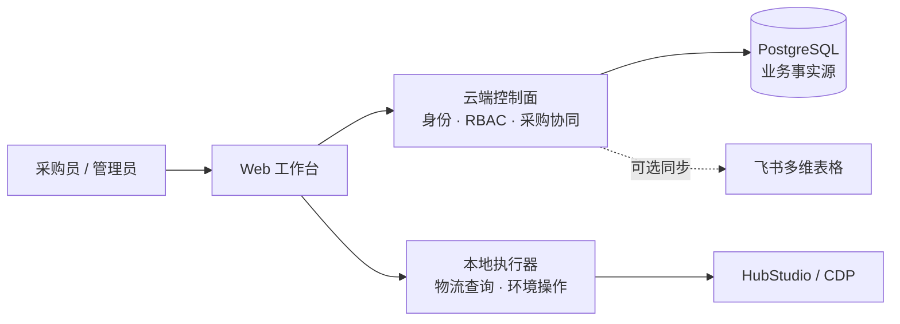

# Xynigo Sourcing

[中文](README.md) | [English](README_EN.md)

[](https://github.com/wrangler1024/xynigo-sourcing/releases/latest)
[](https://github.com/wrangler1024/xynigo-sourcing/actions/workflows/tests.yml)
[](LICENSE)

面向跨境电商团队的开源采购协同工具：把采购任务认领、采购执行、买家号与 HubStudio 环境、物流查询及飞书同步串成一条可审计的工作流。

> Xynigo 仍处于早期阶段。项目与 SHEIN、HubStudio、飞书及其他平台均无官方隶属关系；请仅在已获授权的账号、网络和数据范围内使用。

## 项目状态

| 通道 | 版本 | 用途 |
| --- | --- | --- |
| 默认分支 `main` | v0.12.0 | 本地执行器、云端控制面与采购中心的最新公开源码 |
| 最新 Release | [v0.12.0](https://github.com/wrangler1024/xynigo-sourcing/releases/tag/v0.12.0) | Windows / macOS 协同测试包与固定版本源码 |
| 公共 SaaS | 未开放 | 当前云端能力仅用于受控测试，不提供公开注册服务 |

如需体验新版采购中心，可直接下载 v0.12.0 Release；开发者可以使用 `main` 获取最新公开源码，或从 `v0.12.0` 标签检出可复现的固定版本。

## 系统架构

Xynigo 采用“云端控制面 + 本地执行器”的混合架构。身份、权限和采购协同状态由控制面管理；需要本机浏览器、HubStudio 或本地文件的动作留在采购员电脑上执行。



这套边界避免把本地浏览器控制能力暴露到公网，也为后续设备授权、任务派发和审计留出了清晰接口。

## 当前能力

### 采购中心

- 飞书 OAuth 登录、待审批成员、角色权限、会话撤销。
- 公共待认领采购池、批量勾选认领、店铺与运营筛选。
- 采购单金额、采购指导额、利润与利润率汇总展示。
- 采购员个人执行工作台：待采购、部分完成、本次下单中、跟单中和异常状态。
- 采购单详情、收件与配送信息、商品规格、采购批次及跟单入口。
- 受约束的“退回采购任务”操作，避免已产生正式采购批次后误退。

### 本地自动化

- 店小秘物流单号查询与结果导出。
- 买家号登记、注册辅助和分组处理。
- HubStudio 采购环境批量创建、环境状态查询与复用保护。
- Hub API 请求节流、失败冷却、重复请求抑制和半创建环境接管。
- 飞书多维表格 OpenAPI 预检、幂等写入与读回校验。

### 交付与更新

- Windows x86_64 与 macOS arm64 绿色包。
- 包内版本元数据、SHA-256 校验和安全更新流程。
- Python 3.9、3.11、3.12 持续集成测试。
- 公共发布审计，阻止凭证、私有基础设施信息和本地配置进入产物。

## 功能成熟度

| 领域 | 当前状态 | 说明 |
| --- | --- | --- |
| 物流查询、买家号登记、Hub 环境管理 | 可用 | 由本地执行器完成 |
| 登录、成员审批、角色与会话管理 | 协同测试 | 云端控制面已接入 |
| 采购任务认领与个人执行工作台 | 协同测试 | v0.12.0 已提供读取、筛选、认领和受约束退回 |
| 快捷下单入口 | 原型 / 接口准备中 | 尚未形成完整、可持久化的真实付款状态机 |
| 付款结果、平台订单、物流商与物流单号持久化 | 规划中 | 将按采购批次建模，而不是直接挂在采购单汇总行 |
| 字段级数据权限 | 规划中 | 用于按角色屏蔽店铺、运营、销售额、利润等字段 |
| 公共生产 SaaS | 未提供 | 尚未完成生产级设备授权、监控、备份和回滚验收 |

## v0.12.0 重点更新

- 将“采购任务”和“采购执行”拆成公共认领池与个人工作台。
- 支持批量认领、店铺/运营筛选以及采购金额、利润、利润率字段。
- 增加采购单详情、收件信息、采购批次、跟单与安全退回入口。
- 优化操作列、下拉菜单、搜索框和高密度表格布局。
- 为 HubStudio 建环境加入节流、冷却和半创建环境复用，降低频繁请求失败。
- 统一 Windows、macOS 发布清单与更新校验。

完整安装包、校验值和变更说明见 [v0.12.0 Release](https://github.com/wrangler1024/xynigo-sourcing/releases/tag/v0.12.0)。

## 快速开始

### 方式一：下载绿色包

从 [Releases](https://github.com/wrangler1024/xynigo-sourcing/releases) 下载与系统匹配的压缩包，解压后按包内说明启动。建议先使用脱敏样例验证，再连接真实平台账号。

### 方式二：从源码运行 v0.12.0

要求 Python 3.9 或更高版本。

```bash
git clone --branch v0.12.0 --depth 1 https://github.com/wrangler1024/xynigo-sourcing.git
cd xynigo-sourcing
python -m venv .venv
source .venv/bin/activate
python -m pip install -e .
xynigo-sourcing
```

Windows PowerShell 激活虚拟环境：

```powershell
.venv\Scripts\Activate.ps1
```

启动后访问终端输出的本地地址。服务默认从 `127.0.0.1:8765` 开始寻找可用端口；不要把本地执行端口直接暴露到公网。

## 配置原则

配置优先通过应用界面或运行时环境变量提供。仓库和发布包不包含真实 Cookie、令牌、账号密码或团队专用网络地址。

常用环境变量：

| 变量 | 用途 |
| --- | --- |
| `XYNIGO_AUTH_BASE_URL` | 指定受控云端认证与采购 API 地址 |
| `XYNIGO_RELEASE_CHANNEL` | 更新通道，例如 `stable` 或 `test` |
| `XYNIGO_UPDATE_MANIFEST_URL` | 自定义更新清单地址 |
| `XYNIGO_PROXY_LINK` | 运行时提供代理订阅模板或地址 |

敏感值应存入操作系统安全存储或仅存在于当前进程环境中，不要写入代码、日志或提交记录。

## 测试与发布审计

本地执行器：

```bash
python -m unittest discover -s tests -v
python scripts/audit_public_release.py
```

v0.12.0 云端认证服务（要求 Python 3.12）：

```bash
cd cloud/auth-service
python -m pip install -e '.[test]'
pytest -q
```

组装绿色包：

```bash
bash 组装Windows绿色包.sh
bash 组装macOS绿色包.sh
```

## 安全边界

- 只操作已授权的买家号、店铺、浏览器环境和订单数据。
- 真实注册、下单、付款、删除环境和批量写入必须由操作员明确确认。
- 列表接口不应返回完整电话和详细地址；敏感明细需要后端权限校验和审计。
- PostgreSQL 是采购业务事实源；飞书多维表格只作为可选镜像或协同视图。
- 更新前校验发布清单和 SHA-256，不执行来源不明的更新包。
- 发现安全问题请遵循 [SECURITY.md](SECURITY.md)，不要在公开 Issue 中披露凭证或真实订单数据。

## 路线图

- 建立“下单尝试 → 结算方案 → 付款结果 → 跟单批次”的完整状态机。
- 按采购批次持久化平台订单号、物流商、物流单号和跟单状态。
- 增加字段级数据权限、个人与团队业绩统计。
- 完善云端设备注册、本地执行器授权、任务派发与在线状态。
- 部署业务日志、系统日志、告警、备份、恢复和回滚能力。
- 在满足生产门禁后再评估开放公共 SaaS。

## 参与贡献

欢迎通过 [Issues](https://github.com/wrangler1024/xynigo-sourcing/issues) 提交 Bug、需求和可复现的脱敏样例。提交代码前请先运行测试与公共发布审计，并确保不包含任何真实凭证、个人信息或私有基础设施地址。

## License

[Apache License 2.0](LICENSE)
