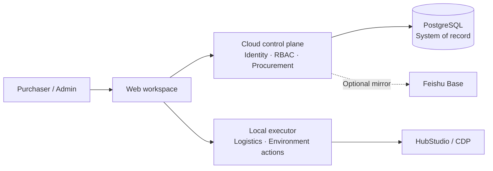

# Xynigo Sourcing

[中文](README.md) | [English](README_EN.md)

[](https://github.com/wrangler1024/xynigo-sourcing/releases/latest)
[](https://github.com/wrangler1024/xynigo-sourcing/actions/workflows/tests.yml)
[](LICENSE)

An open-source sourcing orchestration tool for cross-border ecommerce teams. It connects task claiming, purchase execution, buyer accounts, HubStudio environments, logistics lookup, and optional Feishu synchronization in one auditable workflow.

> Xynigo is an early-stage project. It is not officially affiliated with SHEIN, HubStudio, Feishu, or any other platform. Use it only with accounts, networks, and data you are authorized to access.

## Project status

| Channel | Version | Purpose |
| --- | --- | --- |
| Default branch `main` | v0.10.0 | Stable source baseline for the local executor |
| Latest Release | [v0.12.0](https://github.com/wrangler1024/xynigo-sourcing/releases/tag/v0.12.0) | Coordinated test packages and matching source for Windows and macOS |
| Public SaaS | Not available | Cloud capabilities are currently limited to controlled testing |

To try the new procurement workspace, download the v0.12.0 Release or check out the `v0.12.0` tag. The default branch is intentionally not presented as the latest coordinated test build.

## Architecture

Xynigo uses a hybrid cloud-control-plane and local-executor architecture. Identity, permissions, and procurement collaboration state live in the control plane. Actions that require a local browser, HubStudio, or local files stay on the purchaser's computer.



This boundary keeps local browser-control capabilities off the public internet and leaves clear interfaces for future device authorization, task dispatch, and auditing.

## Current capabilities

### Procurement workspace

- Feishu OAuth, pending-member approval, role-based access control, and session revocation.
- A shared unclaimed-task pool with checkbox batch claiming and store/operator filters.
- Purchase amount, guidance amount, profit, and profit-rate summaries.
- A personal execution workspace with pending, partially completed, checkout-in-progress, tracking, and exception states.
- Purchase details, shipping information, product specifications, purchase batches, and tracking entry points.
- Guarded return-to-task actions that prevent accidental returns after formal purchase batches exist.

### Local automation

- Logistics tracking-number lookup and result export.
- Buyer-account intake, registration assistance, and grouped processing.
- Batch HubStudio procurement-environment creation and status inspection.
- Hub API pacing, failure cooldown, duplicate-request suppression, and adoption of half-created environments.
- Feishu Base OpenAPI preflight checks, idempotent writes, and read-back verification.

### Delivery and updates

- Portable packages for Windows x86_64 and macOS arm64.
- Version metadata, SHA-256 verification, and a guarded update flow.
- Continuous integration on Python 3.9, 3.11, and 3.12.
- A public-release audit that blocks credentials, private infrastructure details, and local configuration from artifacts.

## Capability maturity

| Area | Status | Notes |
| --- | --- | --- |
| Logistics lookup, buyer-account intake, Hub environment management | Available | Executed locally |
| Sign-in, member approval, roles, and session management | Coordinated testing | Connected to the cloud control plane |
| Task claiming and personal procurement workspace | Coordinated testing | v0.12.0 provides reading, filtering, claiming, and guarded return |
| Quick-checkout entry point | Prototype / API preparation | A durable real-payment state machine is not complete |
| Payment result, marketplace order, carrier, and tracking persistence | Planned | These will be modeled per purchase batch rather than on the summary row |
| Field-level data permissions | Planned | Intended to hide store, operator, sales amount, profit, and similar fields by role |
| Public production SaaS | Not provided | Production device authorization, monitoring, backup, and rollback gates are incomplete |

## v0.12.0 highlights

- Split procurement into a shared claiming pool and a personal execution workspace.
- Added batch claiming, store/operator filters, purchase amount, profit, and profit-rate fields.
- Added purchase details, shipping information, purchase batches, tracking, and safe task return.
- Improved action columns, dropdown menus, search inputs, and dense table layouts.
- Added HubStudio environment-request pacing, cooldown, and half-created-environment reuse.
- Unified Windows and macOS release manifests and update verification.

See the [v0.12.0 Release](https://github.com/wrangler1024/xynigo-sourcing/releases/tag/v0.12.0) for packages, checksums, and release notes.

## Quick start

### Option 1: download a portable package

Download the package for your operating system from [Releases](https://github.com/wrangler1024/xynigo-sourcing/releases), extract it, and follow the included startup instructions. Validate with sanitized sample data before connecting real platform accounts.

### Option 2: run v0.12.0 from source

Python 3.9 or later is required.

```bash
git clone --branch v0.12.0 --depth 1 https://github.com/wrangler1024/xynigo-sourcing.git
cd xynigo-sourcing
python -m venv .venv
source .venv/bin/activate
python -m pip install -e .
xynigo-sourcing
```

Activate the virtual environment in Windows PowerShell with:

```powershell
.venv\Scripts\Activate.ps1
```

Open the local URL printed in the terminal. The service starts searching for an available port at `127.0.0.1:8765`. Do not expose the local executor directly to the public internet.

## Configuration principles

Prefer the application UI or runtime environment variables for configuration. The repository and release packages do not contain real cookies, tokens, passwords, or team-specific network addresses.

Common environment variables:

| Variable | Purpose |
| --- | --- |
| `XYNIGO_AUTH_BASE_URL` | Controlled cloud authentication and procurement API base URL |
| `XYNIGO_RELEASE_CHANNEL` | Update channel, such as `stable` or `test` |
| `XYNIGO_UPDATE_MANIFEST_URL` | Custom update-manifest URL |
| `XYNIGO_PROXY_LINK` | Runtime proxy-subscription template or URL |

Store sensitive values in operating-system secure storage or the current process environment. Never put them in source code, logs, or commits.

## Tests and release audit

Local executor:

```bash
python -m unittest discover -s tests -v
python scripts/audit_public_release.py
```

v0.12.0 cloud authentication service (Python 3.12 required):

```bash
cd cloud/auth-service
python -m pip install -e '.[test]'
pytest -q
```

Build portable packages:

```bash
bash 组装Windows绿色包.sh
bash 组装macOS绿色包.sh
```

## Security boundaries

- Operate only authorized buyer accounts, stores, browser environments, and order data.
- Real registration, checkout, payment, environment deletion, and bulk writes require explicit operator confirmation.
- List APIs should not return complete phone numbers or street addresses; sensitive details require backend authorization and auditing.
- PostgreSQL is the procurement system of record. Feishu Base is an optional mirror or collaboration view.
- Verify the release manifest and SHA-256 before applying an update.
- Follow [SECURITY.md](SECURITY.md) for security reports. Never disclose credentials or real order data in a public issue.

## Roadmap

- Complete the `checkout attempt → settlement plan → payment result → tracking batch` state machine.
- Persist marketplace order IDs, carriers, tracking numbers, and tracking state per purchase batch.
- Add field-level data permissions and individual/team performance reporting.
- Complete cloud device registration, local-executor authorization, task dispatch, and online status.
- Deploy business logs, system logs, alerts, backup, recovery, and rollback controls.
- Evaluate a public SaaS only after production gates are satisfied.

## Contributing

Bug reports, feature requests, and reproducible sanitized samples are welcome in [Issues](https://github.com/wrangler1024/xynigo-sourcing/issues). Run the tests and public-release audit before submitting code, and make sure no real credentials, personal data, or private infrastructure addresses are included.

## License

[Apache License 2.0](LICENSE)
