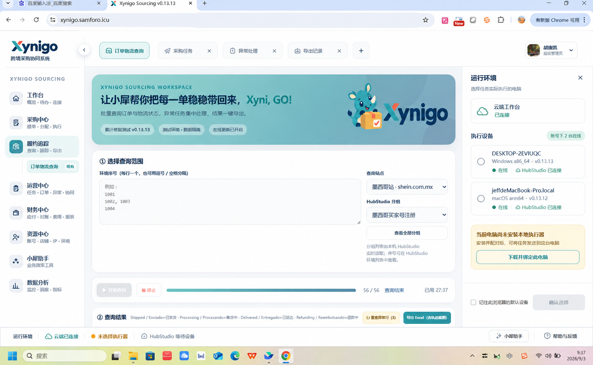

# Xynigo 云端工作台导航与连接状态交互方案 v2

## 目标

- 顶部空间优先服务不断增加的业务功能标签。
- 云端、执行器和 HubStudio 状态持续可见，但不抢占功能导航。
- 小犀助手和提示信息不遮挡左侧菜单或业务内容。
- 多执行器场景必须明确目标设备，未选择时禁止发起本地任务。

## 页面结构

### 顶部功能标签栏

- 顶部移除全部连接状态标签，只保留返回入口、功能标签和账号入口。
- 标签支持关闭、切换和新增；超出可用宽度后横向滚动，并提供“更多标签”入口。
- 标签记录各自的查询条件和未保存状态，切换时不丢失工作上下文。

### 底部运行状态栏

- 状态栏占用固定布局高度，不浮动覆盖页面。
- 依次显示云端状态、当前执行器和所选设备的 HubStudio 状态。
- 未选择执行器时使用琥珀色提示，同时禁用依赖本机的业务按钮。
- 点击任一运行状态，在右侧打开“运行环境”面板。

### 右侧覆盖式面板

- 面板从右侧覆盖展开，不改变主内容宽度，避免表单和结果区重新排版变形。
- 运行环境页展示云端状态、账号下设备、当前电脑安装入口和默认设备设置。
- 设备必须由用户明确选择；设备离线时不自动切换到另一台在线设备。
- 选择结果仅作为该浏览器的默认值，正式任务仍携带明确的 executorId。

### 小犀助手

- 删除左下角黄色提示卡，保留左侧菜单中的“小犀助手”功能入口。
- 左侧入口继续打开原有“采购协作导入”功能，不增加重复的底部快捷入口。
- 本次改造不改变小犀助手的业务流程和权限控制。

## 状态文案规则

- 云端：`云端已连接`、`云端连接异常`。
- 执行器：`未选择执行器`、`设备名 · 在线`、`设备名 · 离线`。
- HubStudio：`等待设备`、`已连接`、`未连接`。
- 账号级在线数量只在运行环境面板显示，不使用“本地执行器在线”暗示当前电脑状态。

## 验收重点

- 新电脑未安装执行器时，顶部不再显示“本地执行器在线”或“HubStudio 已连接”。
- 功能标签增加后不会被连接状态挤占。
- 左侧所有菜单在常见分辨率下均可访问，不被小犀提示遮挡。
- 未选择设备时无法启动查询、采购或其他本地任务。
