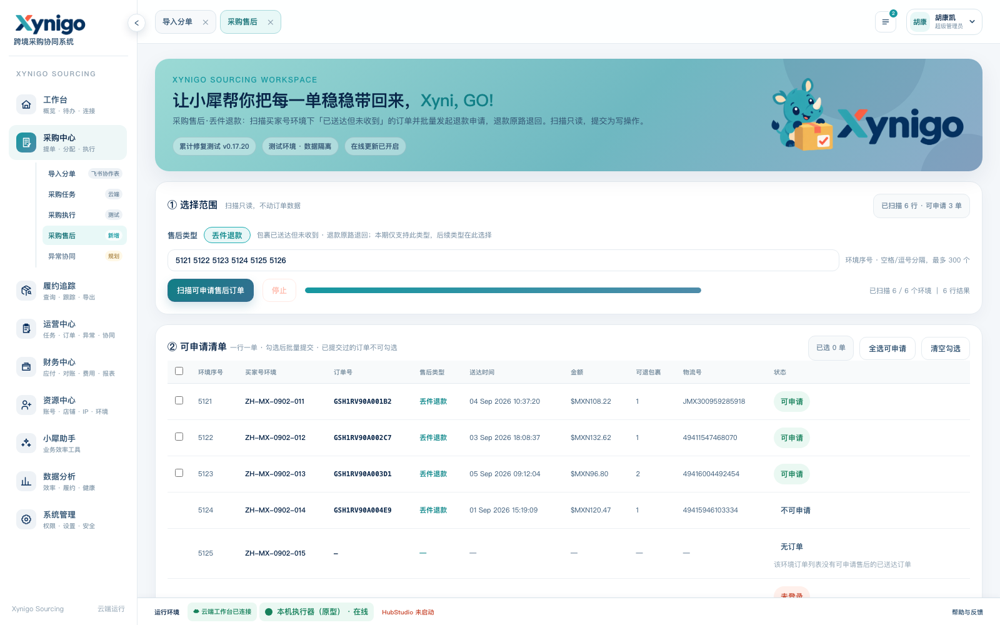
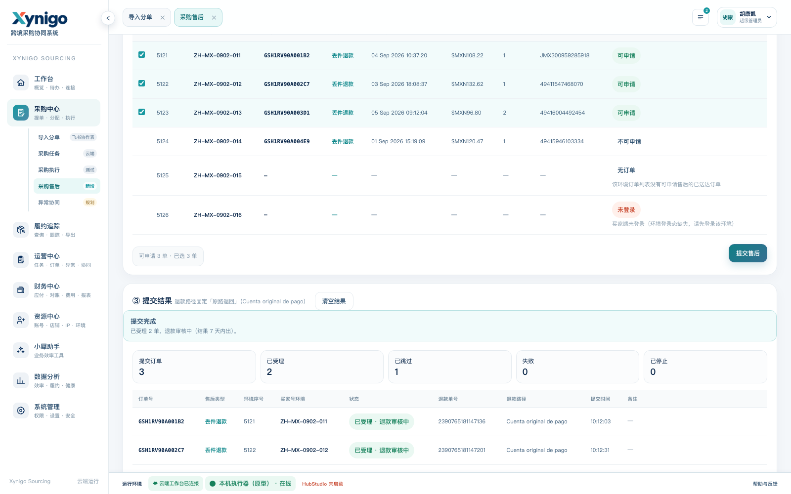

# 采购售后（丢件退款）· 前端交互原型 v1

可交互原型：`20260915-procurement-after-sale-v1.html`





## 怎么打开

必须走 HTTP（工作台在 `file://` 下会直接拒绝接口调用）：

```bash
python3 -m http.server 8899 --directory docs/prototypes
# 浏览器访问
# http://127.0.0.1:8899/20260915-procurement-after-sale-v1.html?runtime=cloud
```

打开后会自动停在「采购中心 › 采购售后」。点「扫描可申请售后订单」即可走完两条交互链（扫描 → 勾选 → 提交）。

## 这个原型怎么来的

**不是手写的样式近似件**，而是取真实工作台页面 `src/purchase_tool/web/index.html` **逐字复制**，只在主脚本之前注入一层 mock 数据适配器，把 `/v1/*` 请求换成脚本化响应。因此：

- CSS、DOM 结构、交互逻辑、二级页签、运行环境状态栏与线上**完全同源**，不存在风格漂移；
- 页面本身仍是一份可增量维护的产物：改动真页面后重跑生成脚本即可刷新原型。

重新生成：

```bash
python docs/prototypes/build_procurement_after_sale_prototype.py
```

生成脚本同时把 `/v1/executors` 预置为「本机执行器（原型）· 在线」，避免工作台因未选执行器自动拉起右侧运行环境面板遮挡页面。

**页面内所有环境序号、环境名、订单号、买家号、退款单号均为合成数据**，不对应任何真实业务记录。

## 本次开发范围

- 模块名：采购售后（二级菜单，位于「采购中心」下）。
- 售后类型：**丢件退款**——买家端「包裹已送达但未收到」的订单，退款原路退回。
- 只做这一个类型；页面上以图例与该类型名称标注，后续新增类型时再扩展。

## 页面结构与交互

### ① 选择范围

- 单行输入环境序号，空格 / 逗号分隔，最多 300 个（沿用工作台既有输入习惯，不做多行文本域）。
- **售后类型是独立字段**（不是只写在小字图例里）：左侧标签「售后类型」+ 青色胶囊「丢件退款」，
  右侧说明「包裹已送达但未收到 · 退款原路退回；本期仅支持此类型，后续类型在此选择」。
- 「扫描可申请售后订单」只读；进度条按**环境**计数，右侧同时给出结果行数。

### ② 可申请清单

- 一行一单（不是一环境一行）：同一环境有多单时各自成行，便于按单勾选。
- 只有 `平台判定可申请` 的行才可勾选；已提交过的订单由平台划入不可退，复选框不渲染，天然幂等。
- **清单里带「售后类型」列**（订单号之后），逐行显示本单做的售后类型；没有订单的环境行该列显示 —。
- 状态列区分：可申请 / 不可申请 / 无订单 / 未登录 / 失败 / 已停止，失败行附一行原因。
- 底部「可申请 N 单 · 已选 M 单」+「提交售后」；另有「全选可申请」「清空勾选」。

### ③ 提交结果

- 运行横幅显示阶段（提交中 / 已完成）与进度；停止按钮可中断，已提交的不会回滚。
- 五个统计：提交订单 / 已受理 / 已跳过 / 失败 / 已停止。**已跳过**单列，不计入失败（重复扫描重跑时不该把整批报成失败）。
- 结果表：订单号、**售后类型**、环境序号、买家号环境、状态、退款单号、退款路径、提交时间、备注。
- 「异常与跳过详情」折叠区汇总需要人工看的行；失败行带异常截图（真机上由执行器回传）。

## 交互节奏（原型里已模拟）

- 扫描：结果分四批出现，进度条与行状态可见地推进。
- 提交：逐单串行出现结果，最后一单演示「不可申请（已提交过）」的跳过分支，用来核对跳过与失败的区分。
- 真机上：单环境内逐单串行、单与单之间随机停 5~15 秒，环境之间串行，写操作不并发。

## 验收重点

- 模块名与售后类型是否就是「采购售后 / 丢件退款」的口径；类型字段与表格列的位置、写法是否合适。
- 一行一单的清单形态是否符合采购部按单勾选的习惯。
- 不可勾选（已提交过）的视觉是否足够清楚，会不会误以为可以重复提交。
- 「已跳过」与「失败」分开统计是否认同。
- 退款路径固定「原路退回」且页面上不提供选项，是否接受。
- 提交前的确认是否够（当前是直接提交，没有二次确认框）。
