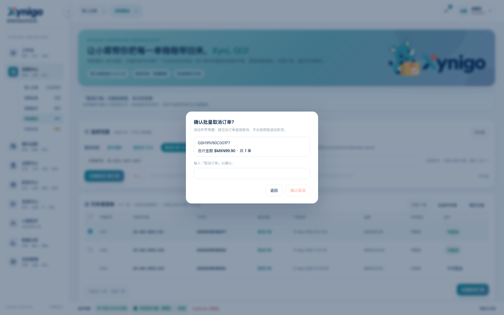
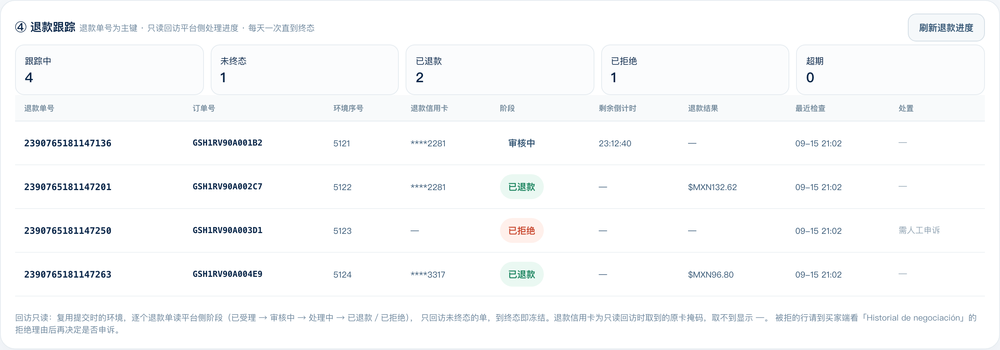
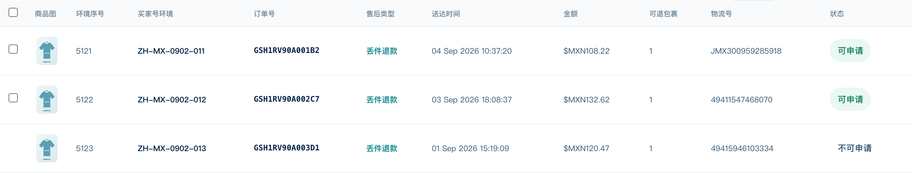

# 采购售后 · 多类型三级菜单设计样稿 v2

设计样稿：`20260915-procurement-after-sale-v2-multitype.html`（**规划，未实现**）



## 怎么打开

```bash
python3 -m http.server 8899 --directory docs/prototypes
# http://127.0.0.1:8899/20260915-procurement-after-sale-v2-multitype.html?runtime=cloud
```

打开后停在「采购中心 › 采购售后」，顶部的三张类型卡可直接点着切。

## 这份样稿要回答什么

丢件退款已在做；将来还会有催发货、取消订单等类型。问题是：这些类型是各做一个页面，还是共用一套页面骨架、只换一个类型？样稿给出的答案是后者。

## 为什么能共用一套骨架

把三类摊开看，判定条件、动作、结果字段、风险档位确实不同，但**作业骨架完全一致**：选范围 → 扫描出清单 → 勾选 → 批量执行 → 看结果。

| 维度 | 丢件退款（已实现） | 催促发货（规划） | 取消订单（规划） |
|---|---|---|---|
| 可做条件 | 已送达但未收到 | 已付款未发货 | 未发货且平台允许取消 |
| 动作 | 提交退款申请 | 点催发货 | 提交取消（**不可逆**） |
| 结果字段 | 退款单号、退款路径 | 催发时间、下次可催 | 取消结果、退款金额 |
| 幂等 | 平台天然幂等 | **要自己记「今天催过没有」** | 平台天然幂等 |
| 风险 | 中 | 低 | **高** |
| 图标语义 | 退回箭头 | 时钟（催＝赶时间） | 单据 + ×（与「采购中心」的单据 + ✓ 成对） |

## 三级菜单形态：选择范围上方的卡片式类型选择器（Jeff 拍板）

不改二级页签结构（导入分单 / 采购任务 / 采购执行 / 采购售后 / 异常协同 保持不变）；类型选择做成**卡片式选择器，放在「① 选择范围」上方**，形态直接复用「资源中心 › 环境创建」的类型卡（工作台既有 `.mode-bar` / `.mode-tab` class，选中态有青色描边与光晕）；卡片左侧图标不用 emoji，改用**一级菜单同款的线性图标**——直接复用侧栏的 `.nav-icon` / `.nav-text`：32×32 圆角砖 + 18px 描边 SVG（stroke 1.9、圆头圆角），选中时图标砖与侧栏一致换成渐变底、图标转白。切换类型即换清单列、结果列与动作文案；下方紧跟一行该类型的「适用条件 · 权限码」。页签栏不膨胀，一次只做一种类型。

样稿里可直接体验到的差异：

- **丢件退款**：① 三段式原样；提交按钮「提交售后」；提交前无二次确认；③ 结果表新增「**退款信用卡**」列（原路退回落到哪张卡，如 `****2281`）与「**送达时间**」列，原「提交时间」改名为「**操作时间**」。
- **催促发货**：清单多「已催次数 / 下次可催」两列；按钮变「批量催促发货」；「冷却中」的行不可勾选。
- **取消订单**：清单多「可否取消」列；**提交前弹出二次确认**——列出将取消的单、合计金额、不可逆提示，并要求输入「取消订单」四个字才解锁确认按钮。

类型卡与顶部横幅均已注明「规划类型，本次未实现」，chip 上也带「规划」字样，避免被当成已实现能力。

## 四条必须一起定的规则

1. **权限要按类型拆。** 现在整模块共用 `assistant.access`——加上「取消订单」后，有采购权限的人就能批量取消订单。应拆成 `procurement.aftersale.refund` / `.urge` / `.cancel`，高危类型单独授权。类型卡下方那行提示里已把这个权限码显示出来。
2. **确认强度按类型配。** 低危（催发货）直接提交；中危（丢件退款）两步式；高危（取消订单）二次确认 + 确认词。做成类型配置项，而不是全局开关。
3. **切换类型要保住各自作业状态。** 切走再切回，扫描结果/勾选/运行中的任务不能丢；运行中切走要有提示（后台继续跑）。
4. **代码做成类型配置表。** 每类一份配置（可用条件、动作文案、确认强度、结果列、所需权限、执行器能力位），骨架读配置渲染；新增类型 = 加一份配置 + 执行器侧实现一个动作，不复制页面。

## 什么时候该升级成独立二级页签

两种信号：① 类型超过 5~6 个明显拥挤，或需要同时开多个类型对照；② 某类型使用频率高到值得一键直达。工作台的多页签机制（`openFeatureTabs` + 各页签记录自身上下文）天然支持这种升级，成本不高。

## 例外：骨架装不下的类型

如果将来出现需要人工填额外信息的类型（例如「退货退款」要选退货方式、填寄回单号、上传凭证），就在该类型下加「专属中间步骤」，但仍是同一骨架的扩展点，不另起页面。判断标准：**是否需要人工填额外信息**。

## 这份样稿的技术做法

与主原型一致——逐字复制真实工作台页面，注入数据 mock 后，再叠一层设计补丁（`build_procurement_after_sale_multitype_prototype.py`）。补丁只做三件事：把类型选择做成选择范围上方的卡片式 `.mode-bar`（与 环境创建 同款）、按类型切换两张表的列与说明、给高危类型演示二次确认弹层。所有元素复用工作台既有 class（`.mode-bar` / `.mode-tab` / `.nav-icon` / `.nav-text` / `.modal-mask` / `.modal` / `.pill` / `.card`），不引入新配色。卡片内容布局（`.mode-tab-inner`）与选中态图标砖渐变（`.mode-tab.active .nav-icon`）已提到全局样式，「资源中心 › 环境创建」的两张类型卡也已同步改成同一套图标，因此样稿与真实页面完全同源、无局部私有样式。类型图标为 24×24 viewBox 的描边路径，与一级菜单图标同规格。数据全部为合成数据。

## 与当前实现的关系

- 当前代码只实现「丢件退款」，类型是常量 `AFTER_SALE_TYPE`，页面上是 ① 里的一个只读胶囊（见 `20260915-procurement-after-sale-v1.md`）。
- 本样稿是把类型选择**上移并升级为卡片式选择器**之后的形态预览（① 里的旧胶囊在样稿中隐藏）；真正落地时按第 4 条的配置表改造，并同步拆权限。

## 命名口径

类型名统一为四字：**丢件退款 / 催促发货 / 取消订单**。「催发货」原为三字，业务含义不变，改为四字「催促发货」以求名称整齐（备选「跟催发货」，偏供应链术语）。清单里的行状态（如「可催发货」）与动作按钮（如「批量催促发货」）不受此限，按自然表达。

## 顺带同步的一处

「资源中心 › 环境创建」的类型卡原用 emoji（🔢 绑号环境 / 📦 备用·测试环境）表达类型，与页面线性风格冲突；已一并换成侧栏同款线性图标：绑号环境＝链接（绑），备用·测试环境＝包裹（备）。与采购售后的三张卡共用同一套全局样式。


## 待落地的字段：退款信用卡

③ 提交结果新增「退款信用卡」列（原路退回落到哪张卡）。样稿里是示意值 `****2281`。

真机上要拿到这个值，需要在**执行器侧**补一步：提交成功跳到 `/orders/refundLabel/...` 之后，读退款成功页的退款账户信息（真机实测该区块在 `.refundAccount-info` 内，掩码形如 `****2281`），再经「执行器行投影 → 云端契约与结果表 → Web 列」四层带上。
注意：该区块在实测中出现过渲染为占位文案 `Error` 的情况（账户明细接口返回空），因此这一字段**必须有一次真机提交来确认取值与降级**，取不到时按 `—` 展示，不阻断提交。

## ④ 退款跟踪（本次新增）

丢件退款提交后，平台侧还要走一段：`已受理 → 审核中(Reseña de SHEIN/Vendedor，24h 倒计时) → 处理中(Procesamiento de reembolsos) → 已退款 ／ 已拒绝`，页面写明结果 7 天内给、原卡 5–15 个工作日到账。所以「提交成功」不等于「钱回来了」，必须有跟踪。



设计要点：

1. **主键是退款单号**（提交时就已拿到 `refund_bill_id`），一行一个退款单，不按订单也不按环境。
2. **数据来源全部只读**：复用提交时的环境，逐个退款单回访平台侧阶段——订单详情的商品行状态、退款单页 `/orders/refundLabel/<billno>?refund_bill_id_list=…` 的三段进度条与倒计时。
3. **只回访未终态的单**：到「已退款／已拒绝」即冻结，不再扫；因此批次会自然收敛，不会无限跑。
4. **节奏**：提交后 T+1 起每天一次；低频率、不并发、复用同环境同账号，避免账号风控。
5. **建议做成 scan 型任务**（只读、一次往返、不建 Run），比提交那种 Run 型轻得多。
6. **落一张跟踪表**，按 `refund_bill_id` 唯一：当前阶段 + 最近检查时间 + 事件时间线（append-only）。与提交结果表的分工是——提交结果＝我提交了什么；跟踪表＝平台后来怎么处理。

三个要盯的异常（「处置」列给建议）：

- **已拒绝**：到买家端看「Historial de negociación」的拒绝理由，再决定是否申诉 → 标「需人工申诉」。
- **超期**：超过 7 天仍未出结果 → 标异常，人工去买家端核。
- **倒计时归零但状态没变**：可能是结算延迟，连续两次仍不变再标异常。

触发方式：先做**手动**「刷新退款进度」按钮（成本低、可控）；云端定时任务（每天定点自动跑）需要云端加调度，属于更大的改动，暂不排。

### 退款信用卡这一列怎么来的

退款信用卡是**只读回访时取到的原卡掩码**（真机实测在退款单页的退款账户区块，形如 `****2281`）。因此它的口径是：提交那一刻不一定取得到，先显示 `—`；跟踪回访读到后回填。③ 提交结果与 ④ 退款跟踪两张表都展示这一列，但以 ④ 为准（那里是回访结果）。

## 商品图列（本次新增，三张表都有）

② 可申请清单、③ 提交结果、④ 退款跟踪 三张表都加「商品图」列，放在**订单号列的右边**，尺寸 34×44（密集表格档，不撑高行）。



**实现上几乎没有新东西**——工作台早有成套约定，直接复用：

| 复用项 | 说明 |
|---|---|
| `.procurement-image-thumb` | 采购任务已在用的缩略图样式；本模块按密集表格覆写为 34×44 |
| `safeProcurementImageUrl()` | 现成的图片地址白名单：只放行 `https://*.ltwebstatic.com`（SHEIN 商品图 CDN）与同源 `/preview-product-*`（本地占位图） |
| `loading="lazy"` + `referrerpolicy="no-referrer"` | 与采购任务同款：懒加载，且不把工作台地址带给外部 CDN |

数据来源不用新接口：扫描时调用的 `refund_only/pre_info` 本来就返回`package_module.package_list[].item_list[].goods_img`，执行器当前只取了包裹号与物流号、把这个图片地址丢了；带上它即可，一路走到三张表。

### 直引外链图片的两项前置核实（已实测）

1. **CSP 允许**：云端根页面的策略含 `img-src 'self' data: blob: https:`，即允许加载任意外部 https 图片；同时带 `Referrer-Policy: no-referrer`，不会把工作台地址泄给 CDN。
2. **CDN 允许裸引**：`img.ltwebstatic.com` 的商品图不带 SHEIN referer、甚至带无关 referer 请求均返回 `200 / image/jpeg`（实测 13KB、220×293），没有防盗链。

因此**不需要在执行器侧下载图片再回传**（那会让每行几 KB～几十 KB 的 base64 走一遍云端，行数一多就把进度快照撑爆）。浏览器直连 CDN 是更省的做法；真要离线或断网场景，再退回「执行器转存 + 云端附件」那条路。

样稿里用的是仓内本地的 `preview-product-*.svg` 占位图——既让原型离线可用，也不把真实商品图地址写进版本库；生产环境走 CDN 真图。

### 三张表的最终列序

```
② 可申请清单  ☑ | 环境序号 | 买家号环境 | 订单号 | 商品图 | 售后类型 | 送达时间 | 金额 | 可退包裹 | 物流号 | 状态
③ 提交结果   订单号 | 商品图 | 售后类型 | 环境序号 | 送达时间 | 退款单号 | 退款路径 | 退款信用卡 | 状态 | 操作时间 | 备注
④ 退款跟踪   退款单号 | 订单号 | 商品图 | 环境序号 | 退款信用卡 | 阶段 | 剩余倒计时 | 退款结果 | 最近检查 | 处置
```

「操作时间」的来由：③ 原本已有「提交时间」，语义就是这次售后动作发生的时间，因此直接沿用该字段并改名为「操作时间」，不再另起一列——否则会出现两个同义列。

③ 的「送达时间」不需要新接口：扫描阶段（`pre_info` 之外，线索来自订单卡片）已经拿到送达时间，前端按订单号与扫描清单关联即可，同一次会话内数据就在手上。真机实现时若跨会话，则把送达时间随提交条目一起落库。
