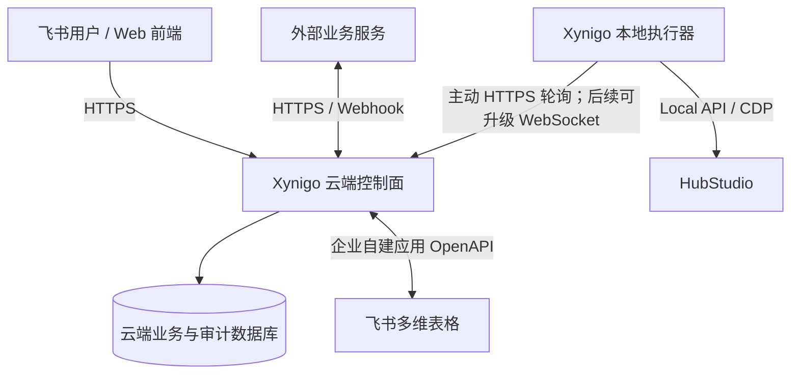

# Xynigo Sourcing 后端实施交接

更新时间：2026-08-24

前置里程碑：[`里程碑/20260824-前端页面改造完成.md`](里程碑/20260824-前端页面改造完成.md)

## 交接目标

在保持本地正式功能可用的前提下，逐步形成“云端控制面 + 本地执行器”后端。实施过程中每个阶段都必须可独立测试、可回滚，不能一次性重写现有 `main.py` 或改变真实采购写入语义。

## 当前实现基线

### 运行形态

- 单机 Python 3.9+ 应用。
- `ThreadingHTTPServer` 仅监听 `127.0.0.1`，静态前端与 JSON API 同进程。
- `AppState` 装配 HubStudio、履约查询、注册、买家号库、环境创建、飞书和更新服务。
- 长任务由后台线程执行，运行状态主要保存在内存。
- 飞书企业自建应用凭证保存在系统安全存储，业务路由配置保存在本机配置文件。

### 已有 API 能力

| 领域 | 主要接口 | 说明 |
|---|---|---|
| HubStudio | `/api/hub-status`、`/api/groups`、`/api/group-envs` | 本机连接与环境查询 |
| 履约 | `/api/query`、`/api/progress`、`/api/requery*`、`/api/export` | 查询、重查和导出 |
| 买家号库 | `/api/buyer-library`、`/api/buyer-library/import/parse`、`/commit` | 脱敏列表及号商入库 |
| 注册 | `/api/register/validate`、`/start`、`/progress` | 注册任务与脱敏进度 |
| 环境创建 | `/api/envbatch/*` | 解析、预览、创建、恢复、飞书写回和导出 |
| 配置/飞书 | `/api/config`、`/api/lark/*` | 本机设置、目标解析、字段预检 |
| 更新 | `/api/update/*` | 检查和人工确认更新 |

当前接口是本机内部契约，不是公网 API：没有 `/api/v1` 版本、用户会话、租户隔离、权限中间件、统一错误码或审计上下文。

## 目标职责划分



| 组件 | 应负责 | 不应负责 |
|---|---|---|
| 云端控制面 | 飞书登录、组织角色权限、业务任务、调度、审计、外部服务、飞书同步 | 直接连接员工电脑上的 HubStudio/CDP |
| 本地执行器 | 设备注册、领取任务、HubStudio/CDP 执行、脱敏进度与结果上报 | 保存全组织权限、开放公网入站端口、承担跨用户业务主数据 |
| 飞书多维表格 | 协同查看、人工维护、外部业务表和必要镜像 | 充当高并发账号预占锁或唯一任务队列 |
| 云端数据库 | 用户、角色、权限、任务、幂等、账号分配状态、审计 | 保存不必要的明文密码和 Cookie |

## 分阶段实施路线

### 阶段 0：冻结本地契约与安全基线

目标：先让现有行为可描述、可回归，再拆代码。

工作项：

- 为当前 `/api/*` 建立接口清单，记录请求、响应、状态码、是否只读、是否需要二次确认。
- 为每个真实写接口补充合成数据契约测试和错误脱敏测试。
- 定义统一的 `requestId`、`error.code`、`error.message` 响应结构，但暂不强制一次迁完。
- 明确本地任务互斥矩阵：履约、注册、采购环境、备用环境哪些可并行。
- 固化敏感字段分类与日志禁止清单。

完成门槛：现有 197 项测试继续通过；新增契约测试覆盖所有写接口；不改变用户操作流程。

### 阶段 1：本地后端模块化

目标：在行为不变的情况下，把本地执行器从单文件 HTTP 编排中分离出来。

建议边界：

```text
purchase_tool/
├── api/              # 本地 HTTP 路由、校验和响应模型
├── application/      # 用例与任务编排
├── domain/           # 账号、环境、任务、状态规则
├── integrations/     # HubStudio、CDP、飞书、更新服务
└── runtime/          # 配置、凭证、任务状态与本地持久化
```

实施顺序：先抽取只读接口，再抽取配置接口，最后迁移带真实写入的注册和环境任务。旧 URL 通过兼容路由保留，前端不随拆分反复修改。

本地任务元数据可先使用 SQLite 持久化，但密码、Cookie、App Secret 和访问令牌不得进入任务表。进程重启后只恢复“可安全续作”的步骤；结果不确定的远端写入必须进入人工复核。

完成门槛：重启后能查询历史脱敏任务和确定性状态；现有 API 兼容；发行包仍能离线启动。

### 阶段 2：飞书登录、组织与 RBAC

目标：让系统真正按用户显示模块并在后端拒绝越权操作。

核心模型：

- `tenant`：企业/业务组织；
- `user`：通过飞书 OAuth 映射的用户；
- `membership`：用户在组织内的状态；
- `role`、`permission`、`role_permission`、`user_role`；
- `session`：短期登录会话及撤销状态；
- `audit_event`：登录、权限变更、敏感读取和真实写入。

权限至少分为：模块可见、操作权限、数据范围、敏感字段权限。首批权限码建议覆盖：

- `fulfillment.order.read`、`fulfillment.order.export`；
- `resource.buyer.read`、`resource.buyer.credential.read`、`resource.buyer.import`；
- `resource.environment.create`、`resource.environment.retry`；
- `system.member.manage`、`system.role.manage`、`system.lark_connection.manage`、`system.integration.manage`、`system.audit.read`。

`system.lark_connection.manage` 只授予超级管理员。前端权限摘要对其他用户隐藏“飞书连接”，`/api/lark/config`、目标解析、连接验证及后续模块连接写接口仍必须在后端单独校验并返回 403。普通业务用户只可通过单独的 `/api/lark/status` 读取其业务模块需要的脱敏就绪状态，不能读取应用凭证状态或修改连接；RBAC 接入前须把当前页面初始化使用的配置状态请求迁移到该只读接口。飞书用户登录凭证与多维表格企业应用凭证分别管理。

完成门槛：未授权用户即使手工调用 API 也得到 403；角色变更可审计；停用成员的会话可撤销；测试覆盖跨组织访问。

当前进度（2026-08-24）：已按业务优先级先行建立 `cloud/auth-service/` 认证骨架，并在腾讯轻量服务器部署隔离测试实例。`https://xynigo.samforo.icu` 已具备有效 HTTPS、PostgreSQL 首次迁移、回环端口隔离、备份恢复演练和容器重启验证。真实飞书授权已走到开放平台，但因应用后台尚未登记精确回调 URL 而返回 `20029`；成员审批和角色管理接口也尚未完成。因此阶段 2 仍是“测试部署中”，不能视为生产上线。

### 阶段 3：云端控制面与本地执行器

目标：在腾讯轻量服务器部署首个可控的单节点云端控制面。

首期链路：

1. 管理员在云端创建设备配对码。
2. 本地执行器用一次性配对码换取可撤销的设备凭证。
3. 执行器只通过出站 HTTPS 长轮询领取任务。
4. 云端下发不含多余敏感信息的任务包和幂等键。
5. 执行器定期续租并上报脱敏进度。
6. 完成后上报结构化结果；云端记录审计并驱动飞书同步。

任务模型至少需要：`task_id`、`tenant_id`、`type`、`status`、`idempotency_key`、`executor_id`、`lease_until`、`attempt`、`payload_version`、`created_by`、`result_summary` 和时间戳。

首期不要强制 WebSocket。长轮询更容易穿透员工网络、部署和排障；确认存在低延迟需求后，再把实时进度通道升级为 WebSocket。

完成门槛：断网、重复领取、执行器重启、云端重启均不会重复创建环境；设备可撤销；所有任务可追踪到发起人和执行器。

### 阶段 4：买家号自动分配与环境创建闭环

目标：实现资源中心已经确认的核心流程——只填环境数量和采购员分配，系统自动抽取买家号。

状态建议：

```text
可用 → 已预占 → 绑定中 → 已绑定
             ↘ 释放/超时 → 可用
任意状态 → 异常 / 停用
```

关键规则：

- 分配条件至少包含组织、站点、账号状态、凭证状态和未绑定环境。
- 预占必须由云端数据库事务完成，记录 `allocation_id` 和过期时间。
- 一个账号同一时间只能被一个有效分配占用。
- HubStudio 与飞书属于外部副作用，采用幂等步骤和补偿流程，不假设跨系统事务。
- 未开始创建的失败任务释放预占；创建结果不确定时冻结账号并人工复核，不能自动回池。
- 全部新环境继续在本地无头验证出口 IP。

完成门槛：并发请求不会分配同一账号；故障注入下无重复环境；每个账号、环境和任务之间可追溯。

### 阶段 5：采购、运营、财务及外部服务

建议顺序：采购任务 → 采购执行/异常协同 → 履约事件 → 运营工单 → 对账与应付 → 财务报表。每个模块先确认字段、状态机、责任人、审批、数据权限和验收样例，再开放二级入口。

财务中心不得直接复用普通采购角色权限。金额调整、结算确认、导出和作废必须形成审计事件；涉及审批时优先通过明确的审批适配层对接飞书，而不是把审批状态散落在页面逻辑中。

## 飞书数据对接原则

- 当前买家号统一台账继续保持兼容，不在后端拆分阶段擅自换表。
- 后续订单、采购、运营和财务表分别配置逻辑路由，复用同一 OpenAPI 客户端但独立做表级授权与字段预检。
- 系统前端的增删查改统一经过后端服务；写接口必须校验用户权限、业务状态、幂等键和字段版本。
- 云端数据库保存业务流程和并发控制，飞书保存协同所需字段及外部记录 ID；同步采用写后回读、重试队列和冲突状态。
- 删除优先设计为停用/作废；任何真实物理删除必须单独授权并可审计。

## 第一批后端开发任务

下一次开始编码时，按以下顺序领取，不要并行改造全部模块：

1. 新增当前 API 契约清单和统一错误响应测试。
2. 从 `main.py` 抽取只读路由与应用服务，保持 URL 和响应不变。
3. 引入不含敏感字段的本地任务存储接口及 SQLite 实现。
4. 为任务生成稳定 ID、幂等键和审计上下文。
5. 设计买家号 `reserve/release/bind` 领域接口和并发测试，先使用合成仓储实现。
6. 云端认证骨架已按用户明确指令先行建立；后续本地模块化仍须保持原接口兼容，再把本地页面接入云端会话和权限摘要。

第一批明确不做：把测试实例切换为正式生产入口、真实飞书表迁移、真实账号批量分配、WebSocket、财务写入。

## 开发与验收约束

- 每个阶段先写合成样例和失败场景，再连接真实外部服务。
- 单元测试不得访问真实 HubStudio、飞书、SHEIN 或公网。
- 真实联调必须使用脱敏测试表和测试环境，并保留人工确认门。
- 每次迁移都运行 `PYTHONPATH=src python3 -m unittest discover -s tests`。
- 任何新增云端依赖、数据表或开放端口都要先记录架构决策、备份和回滚方式。
- 完成一个阶段后更新 [`项目记忆.md`](项目记忆.md) 和本交接文档的状态，再开始下一阶段。
