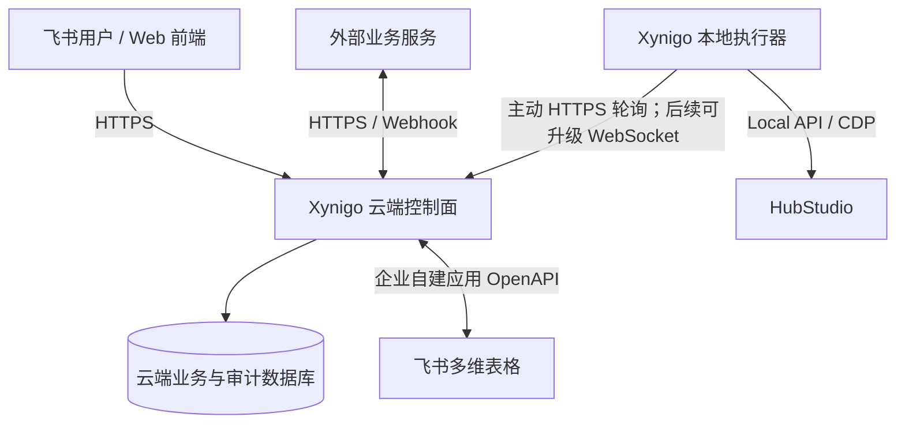

# Xynigo Sourcing 后端实施交接

更新时间：2026-08-25

前置里程碑：[`里程碑/20260824-前端页面改造完成.md`](里程碑/20260824-前端页面改造完成.md)

当前滚动交接：[`当前开发交接.md`](当前开发交接.md)

## 交接目标

在保持本地正式功能可用的前提下，逐步形成“云端控制面 + 本地执行器”后端。实施过程中每个阶段都必须可独立测试、可回滚，不能一次性重写现有 `main.py` 或改变真实采购写入语义。

## 当前实现基线

### 运行形态

- 单机 Python 3.9+ 应用。
- `ThreadingHTTPServer` 仅监听 `127.0.0.1`，静态前端与 JSON API 同进程。
- `AppState` 装配 HubStudio、履约查询、注册、买家号库、环境创建、飞书和更新服务。
- 长任务由后台线程执行，运行状态主要保存在内存。
- 飞书企业自建应用凭证保存在系统安全存储，业务路由配置保存在本机配置文件。

### 已有 API 能力

| 领域 | 主要接口 | 说明 |
|---|---|---|
| HubStudio | `/api/hub-status`、`/api/groups`、`/api/group-envs` | 本机连接与环境查询 |
| 履约 | `/api/query`、`/api/progress`、`/api/requery*`、`/api/export` | 查询、重查和导出 |
| 买家号库 | `/api/buyer-library`、`/api/buyer-library/import/parse`、`/commit` | 脱敏列表及号商入库 |
| 注册 | `/api/register/validate`、`/start`、`/progress` | 注册任务与脱敏进度 |
| 环境创建 | `/api/envbatch/*` | 解析、预览、创建、恢复、飞书写回和导出 |
| 配置/飞书 | `/api/config`、`/api/lark/*` | 本机设置、目标解析、字段预检 |
| 更新 | `/api/update/*` | 检查和人工确认更新 |

当前接口仍是本机内部契约，不是公网 API：没有 `/api/v1` 版本、统一错误码或完整业务审计上下文。本地开发版已经接入云端会话、主要业务权限映射和管理员安全代理；云端管理员及采购 P0 API 已部署，采购数据已按租户隔离并记录关键操作审计，但本地设备任务通道和统一云端任务审计尚未完成。

## 目标职责划分



| 组件 | 应负责 | 不应负责 |
|---|---|---|
| 云端控制面 | 飞书登录、组织角色权限、业务任务、调度、审计、外部服务、飞书同步 | 直接连接员工电脑上的 HubStudio/CDP |
| 本地执行器 | 设备注册、领取任务、HubStudio/CDP 执行、脱敏进度与结果上报 | 保存全组织权限、开放公网入站端口、承担跨用户业务主数据 |
| 飞书多维表格 | 协同查看、人工维护、外部业务表和必要镜像 | 充当高并发账号预占锁或唯一任务队列 |
| 云端数据库 | 用户、角色、权限、任务、幂等、账号分配状态、审计 | 保存不必要的明文密码和 Cookie |

## 分阶段实施路线

### 阶段 0：冻结本地契约与安全基线

目标：先让现有行为可描述、可回归，再拆代码。

工作项：

- 为当前 `/api/*` 建立接口清单，记录请求、响应、状态码、是否只读、是否需要二次确认。
- 为每个真实写接口补充合成数据契约测试和错误脱敏测试。
- 定义统一的 `requestId`、`error.code`、`error.message` 响应结构，但暂不强制一次迁完。
- 明确本地任务互斥矩阵：履约、注册、采购环境、备用环境哪些可并行。
- 固化敏感字段分类与日志禁止清单。

完成门槛：现有 210 项测试继续通过；新增契约测试覆盖所有写接口；不改变用户操作流程。

### 阶段 1：本地后端模块化

目标：在行为不变的情况下，把本地执行器从单文件 HTTP 编排中分离出来。

建议边界：

```text
purchase_tool/
├── api/              # 本地 HTTP 路由、校验和响应模型
├── application/      # 用例与任务编排
├── domain/           # 账号、环境、任务、状态规则
├── integrations/     # HubStudio、CDP、飞书、更新服务
└── runtime/          # 配置、凭证、任务状态与本地持久化
```

实施顺序：先抽取只读接口，再抽取配置接口，最后迁移带真实写入的注册和环境任务。旧 URL 通过兼容路由保留，前端不随拆分反复修改。

本地任务元数据可先使用 SQLite 持久化，但密码、Cookie、App Secret 和访问令牌不得进入任务表。进程重启后只恢复“可安全续作”的步骤；结果不确定的远端写入必须进入人工复核。

完成门槛：重启后能查询历史脱敏任务和确定性状态；现有 API 兼容；发行包仍能离线启动。

### 阶段 2：飞书登录、组织与 RBAC

目标：让系统真正按用户显示模块并在后端拒绝越权操作。

核心模型：

- `tenant`：企业/业务组织；
- `user`：通过飞书 OAuth 映射的用户；
- `membership`：用户在组织内的状态；
- `role`、`permission`、`role_permission`、`user_role`；
- `session`：短期登录会话及撤销状态；
- `audit_event`：登录、权限变更、敏感读取和真实写入。

权限至少分为：模块可见、操作权限、数据范围、敏感字段权限。首批权限码建议覆盖：

- `workbench.access`、`procurement.access`、`operations.access`、`finance.access`、`assistant.access`、`analytics.access`；
- `fulfillment.order.read`、`fulfillment.order.export`；
- `resource.buyer.read`、`resource.buyer.credential.read`、`resource.buyer.import`；
- `resource.environment.create`、`resource.environment.retry`；
- `resource.store.read`、`resource.store.configure`、`resource.store.credential.update`、`resource.store.clone`；
- `resource.ip.read`、`resource.ip.test`、`resource.ip.allocate`、`resource.ip.credential.manage`；
- `system.member.manage`、`system.role.manage`、`system.lark_connection.manage`、`system.integration.manage`、`system.audit.read`。

`system.lark_connection.manage` 与 `system.integration.manage` 统一视为云端服务配置高敏权限，`resource.ip.credential.manage` 视为代理凭证高敏权限，三者只能由 `super_admin` 持有。内置 `admin` 默认获得其余全部日常业务及常规管理权限。前端权限摘要对管理员隐藏“飞书连接/云端服务配置”和代理凭证管理；相关本地敏感接口必须在后端同时校验权限码和 `super_admin` 角色并返回 403。云端角色策略本身也不得把三项高敏权限授给非超级管理员角色。普通业务用户只可通过 `/api/lark/status` 读取脱敏就绪状态，不能读取应用凭证状态或修改连接。

完成门槛：未授权用户即使手工调用 API 也得到 403；当前 `admin` 为 26/29 且直接调用云端配置或代理凭证管理得到 403；只有 `super_admin` 为 29/29；角色变更可审计；停用成员的会话可撤销；测试覆盖跨组织访问。

当前进度（2026-08-24）：已建立 `cloud/auth-service/` 认证服务并在腾讯轻量服务器运行隔离测试实例。`https://xynigo.samforo.icu` 已完成 HTTPS、PostgreSQL、回环端口隔离、备份恢复和“小犀代采”真实飞书 OAuth 验证；迁移仍为 `0002_local_login_bridge`，本批不新增表。本地前端已接入一次性登录桥、系统安全存储、当前成员、退出、模块显示权限和主要业务 API 的后端权限校验。成员审批/停用/恢复、按飞书绑定手机号精确解析并新增待审批成员、自定义角色创建/重命名/安全删除、角色权限配置、成员角色分配、会话摘要与撤销 API 已部署到隔离测试实例；系统角色不可改名/删除，已分配成员的自定义角色不可删除，角色代码和权限码均由后端裁决。手机号不持久化，确认新增时由后端重新向飞书解析；若预分配角色，还需单独通过 `system.role.manage` 权限裁决。“小犀代采”的最小通讯录权限、通讯录数据权限范围和应用可用范围已配置生效，8771 曾成功读取指定普通企业成员的姓名、头像和激活状态，随后取消表单，没有写入成员。权限目录当前为 17 项，规划功能与 Xynigo 数据范围仍未开发。本地 215 项、云端 26 项通过；交接时云端仍为 1 名 active 超级管理员、2 个系统角色和 1 个有效会话。普通成员真实新增/批准/登录/停用闭环和正式绿色包仍未完成，因此阶段 2 仍是“测试运行中”，不能视为正式生产上线。

2026-08-25 增量：内置 `admin`、8 项店铺/代理资源权限和资源中心 P0/P1 已部署到云端测试实例与 8771；目录为管理员 22/25、超级管理员 25/25、成员 0/25，三项高敏权限不可授给其他角色，本地敏感 API 还会二次校验 `super_admin`。本地 223 项、云端 27 项合成测试通过。真实只读验收得到 342 家店铺、2495 个 HubStudio 环境和 500 条代理资产；普通代理台账仍缺飞书表格只读权限，不能判断占用或加载检测凭证。部署后临时误授管理员飞书连接权限，直接调用 8771 配置 API 仍返回 403；代理凭证误授权由目录同步自动清除，临时测试数据已清理。云端仍只有 1 名 active 超级管理员；普通成员真实闭环和正式绿色包尚未完成。

2026-08-25 采购基础已部署：`0003_purchase_request_foundation`、`procurement.request.read/save/submit`、采购三表和草稿/提交/读取 API 先进入云端测试实例；当时目录为管理员 25/28、超级管理员 28/28、成员 0/28。店小秘扩展 `0.1.51` 复用当前身份并区分草稿与正式提交；重复提交后数据库仍只有 1 份主单/明细/Outbox，店小秘审核与飞书 Base 均未触发。Web 采购中心概览/列表/详情随后已随 0004 部署，继续执行读取权限、租户隔离、列表隐私字段排除和详情审计。详见 [`采购中心接口-P0.md`](采购中心接口-P0.md) 和 [`里程碑/20260825-运营采购助手统一身份与正式提交基础.md`](里程碑/20260825-运营采购助手统一身份与正式提交基础.md)。

2026-08-25 采购执行测试版已部署：新增 `procurement.execution.manage` 和 `0004_procurement_execution_test`；明细增加认领人/时间，新增 `purchase_splits`、`purchase_split_lines`。认领接口支持采购单/明细选择、数据库行锁、并发冲突与幂等；分单保存使用 `executionRevision`，原子校验当前采购员归属、全量分配、数量合计、资源组合重复和站点一致。执行队列支持状态、站点、绑定、关键词过滤，并直接返回店铺销售订单号。资源字段只允许安全引用和脱敏标签，不存储密码、Cookie、接码 Key 或飞书凭证。部署前应用、环境和 PostgreSQL 已备份且真实恢复验证通过；云端迁移为 0004，目录为超级管理员 29/29、管理员 26/29、成员 0/29。首轮联调将现有 1 条测试明细认领给当前超级管理员，保存 1 张未绑定资源的 `waiting_binding` 分单并在执行队列按销售订单号命中；认领/分单审计各 1 条，未触发 HubStudio、SHEIN、店小秘审核或飞书写入。本地共 233 项完成（230 通过、3 跳过），云端 37 项通过；真实下单与后续状态写入仍未开放。详见 [`里程碑/20260825-采购执行测试版云端联调.md`](里程碑/20260825-采购执行测试版云端联调.md)。

2026-08-25 成员登录子里程碑完成：v0.11.0 暴露出未认证 `/api/tasks` 轮询的 401 会清除飞书登录轮询，导致回调成功后仍返回登录页。v0.11.1 增加认证前轮询门禁、未过期待登录请求恢复/复用和终止/暂时性错误分流；本地 254 项完成（251 通过、3 跳过），云端 37 项通过，Windows/macOS 包和远端更新发现均通过校验。新刚、志恒已经在各自电脑完成 v0.11.1 安装、飞书授权和工作台登录。该里程碑没有修改云端 API、数据库或迁移，也没有重启测试服务。详见 [`里程碑/20260825-v0.11.1成员登录闭环.md`](里程碑/20260825-v0.11.1成员登录闭环.md)。

### 阶段 3：云端控制面与本地执行器

目标：构建可控的单节点云端控制面。广州多项目共享测试服务器 `shared-test-gz-01`（实例 ID `lhins-b6nu398t`）只允许承载 Xynigo 测试环境；生产控制面必须独立部署到 `xynigo-prod-gz-01`，不得把测试实例原地切换为生产，也不得复制测试数据库或数据卷。详细隔离边界与上线闸门见 [`架构决策-20260825-广州腾讯轻量服务器测试与生产双环境隔离.md`](架构决策-20260825-广州腾讯轻量服务器测试与生产双环境隔离.md)。

首期链路：

1. 管理员在云端创建设备配对码。
2. 本地执行器用一次性配对码换取可撤销的设备凭证。
3. 执行器只通过出站 HTTPS 长轮询领取任务。
4. 云端下发不含多余敏感信息的任务包和幂等键。
5. 执行器定期续租并上报脱敏进度。
6. 完成后上报结构化结果；云端记录审计并驱动飞书同步。

任务模型至少需要：`task_id`、`tenant_id`、`type`、`status`、`idempotency_key`、`executor_id`、`lease_until`、`attempt`、`payload_version`、`created_by`、`result_summary` 和时间戳。

首期不要强制 WebSocket。长轮询更容易穿透员工网络、部署和排障；确认存在低延迟需求后，再把实时进度通道升级为 WebSocket。

完成门槛：断网、重复领取、执行器重启、云端重启均不会重复创建环境；设备可撤销；所有任务可追踪到发起人和执行器。

### 阶段 4：买家号自动分配与环境创建闭环

目标：实现资源中心已经确认的核心流程——只填环境数量和采购员分配，系统自动抽取买家号。

状态建议：

```text
可用 → 已预占 → 绑定中 → 已绑定
             ↘ 释放/超时 → 可用
任意状态 → 异常 / 停用
```

关键规则：

- 分配条件至少包含组织、站点、账号状态、凭证状态和未绑定环境。
- 预占必须由云端数据库事务完成，记录 `allocation_id` 和过期时间。
- 一个账号同一时间只能被一个有效分配占用。
- HubStudio 与飞书属于外部副作用，采用幂等步骤和补偿流程，不假设跨系统事务。
- 未开始创建的失败任务释放预占；创建结果不确定时冻结账号并人工复核，不能自动回池。
- 全部新环境继续在本地无头验证出口 IP。

完成门槛：并发请求不会分配同一账号；故障注入下无重复环境；每个账号、环境和任务之间可追溯。

### 阶段 5：采购、运营、财务及外部服务

建议顺序：采购任务 → 采购执行/异常协同 → 履约事件 → 运营工单 → 对账与应付 → 财务报表。每个模块先确认字段、状态机、责任人、审批、数据权限和验收样例，再开放二级入口。

财务中心不得直接复用普通采购角色权限。金额调整、结算确认、导出和作废必须形成审计事件；涉及审批时优先通过明确的审批适配层对接飞书，而不是把审批状态散落在页面逻辑中。

## 飞书数据对接原则

- 当前买家号统一台账继续保持兼容，不在后端拆分阶段擅自换表。
- 后续订单、采购、运营和财务表分别配置逻辑路由，复用同一 OpenAPI 客户端但独立做表级授权与字段预检。
- 系统前端的增删查改统一经过后端服务；写接口必须校验用户权限、业务状态、幂等键和字段版本。
- 云端数据库保存业务流程和并发控制，飞书保存协同所需字段及外部记录 ID；同步采用写后回读、重试队列和冲突状态。
- 删除优先设计为停用/作废；任何真实物理删除必须单独授权并可审计。

## 下一批后端开发任务：权限收口与采购执行前置

云端认证按用户明确指令先于本地模块化完成。成员、角色、会话 API 与页面已部署到隔离测试实例，新刚、志恒已完成真实登录；下一次按以下顺序收口权限与采购执行边界，不要同时展开生产部署或未经批准的外部写入：

1. 为采购员建立经业务确认的最小权限角色，将新刚、志恒从登录验收用管理员角色降权，验证菜单可见性与后端 403 一致。
2. 完成成员停用、当前/全部会话撤销、停用后 Bearer 即时失效、重新登录拒绝、跨租户不可见和非超级管理员授权上限的真实联调，并记录审计证据。
3. 开通飞书普通表格只读权限并授予 Webshare IP 总表访问，完成占用关系与本机代理检测复验。
4. 审查真实联调日志和审计事件不包含令牌、飞书 Open ID 或其他敏感数据。
5. 设计登录门禁前的安全更新入口或启动期明确更新提示，避免未来登录故障用户只能手动替换绿色包。
6. 与业务方确认同一明细拆数量、资源占用、开始下单、失败回滚、退回和异常状态机，再开发采购执行后续写接口。

阶段 2 完成后，再恢复原定本地模块化顺序：API 契约与统一错误 → 抽取只读路由 → 本地任务持久化 → 稳定任务 ID/幂等/审计 → 买家号 `reserve/release/bind` 并发领域接口。

本批明确不做：把测试实例切换为正式生产入口、在测试服务器创建任何生产资源、真实飞书表迁移、真实账号批量分配、WebSocket、财务写入。生产部署必须使用独立服务器、`/opt/xynigo-auth-prod`、Compose 项目 `xynigo-auth-prod`、空 PostgreSQL 与独立正式 Base/Table；未关闭架构决策中的全部上线闸门前不得开始。

## 开发与验收约束

- 每个阶段先写合成样例和失败场景，再连接真实外部服务。
- 单元测试不得访问真实 HubStudio、飞书、SHEIN 或公网。
- 真实联调必须使用脱敏测试表和测试环境，并保留人工确认门。
- 每次迁移都运行 `PYTHONPATH=src python3 -m unittest discover -s tests`。
- 任何新增云端依赖、数据表或开放端口都要先记录架构决策、备份和回滚方式。
- 完成一个阶段后更新 [`项目记忆.md`](项目记忆.md) 和本交接文档的状态，再开始下一阶段。

## 新会话开场白

> 继续 Xynigo 权限收口与采购执行阶段。请先阅读 `AGENTS.md`、`docs/当前开发交接.md`、`docs/项目记忆.md` 和 `docs/里程碑/20260825-v0.11.1成员登录闭环.md`，核对分支、HEAD、工作区与本地服务，勿擅自停止正在使用的采购实例。v0.11.1 已发布，新刚、志恒已完成真实登录；下一步创建最小权限采购员角色并验证停用/撤权，再补 Webshare 表格授权和采购执行状态机。
